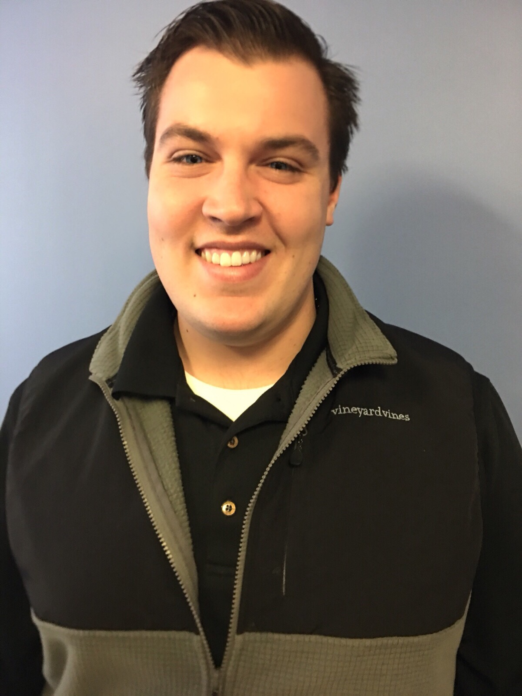

<h2>James DeLay</h2>

<h3>Full Stack Software Engineer</h3>

Hello! My name is James and I am a Full Stack Software Engineer from New York.

While I was pursuing my MBA at Adelphi University I was working as a carpenter. I quickly realized that I loved to build and create things as well as come up with innovative solutions for complex problems. I decided to combine this creative passion with my other passion: technology. This led me to The Fullstack Academy of Code, an immersive coding bootcamp in New York City. It was here where I studied software engineering & web development. After graduating from the program I was selected to return as a Teaching Fellow where I helped students throughout their journey through the Fullstack curriculum. On a daily basis I would hold office hours, prepare notes and articles for students, and give the occasional lecture.

